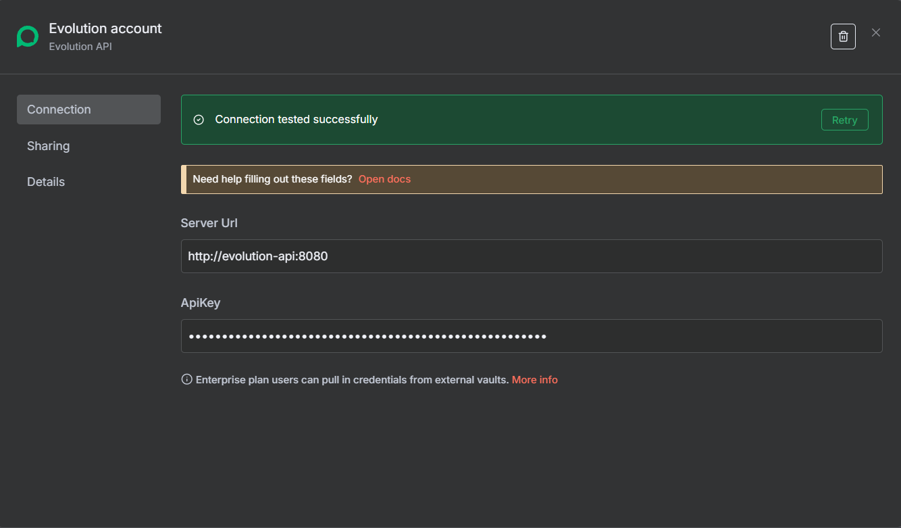
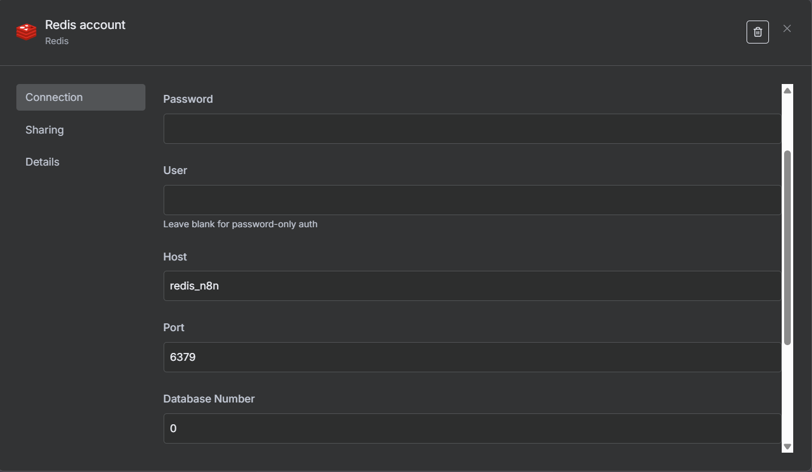
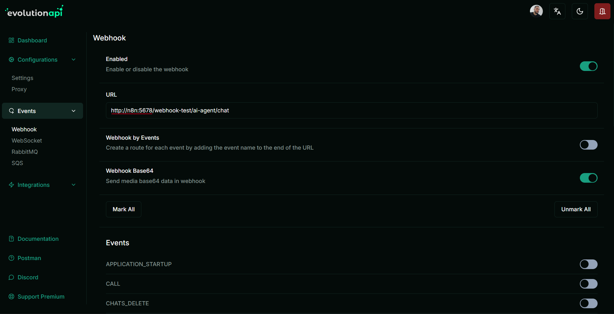

### n8n + Evolution API (Docker Starter)

Guia rápido para clonar, configurar e subir este template (n8n + Evolution API + Postgres + Redis) utilizando Docker.

Este repositório é um modelo com uma Stack Padrão que integra o n8n ao Evolution API, utilizando PostgreSQL como banco de dados e Redis como cache. Ele fornece uma estrutura pronta para desenvolvimento e automação, com serviços orquestrados via Docker Compose.

### Pré‑requisitos

- **Docker Desktop** instalado e em execução
- **Git** instalado (ou baixe o ZIP do repositório)

### Clonar o projeto
Use Git (via terminal) ou baixe o ZIP.

```bash
# via git (recomendado)
git clone https://github.com/rgvieiraoficial/n8n-evo-docker-starter
cd n8n-evo-docker-starter

# ou baixe o ZIP pelo GitHub: Code > Download ZIP, extraia e abra o terminal na pasta do projeto.
```

### Configuração do ambiente (.env)

Este projeto inclui um arquivo `.env.example` (variáveis ambiente que devem ser definidas para os serviços funcionar). Copie-o ou Renomei-o para `.env` e ajuste as variáveis conforme necessário.

```bash
cp .env.example .env
# no Windows PowerShell, você pode usar:
copy .env.example .env
```

- **IMPORTANTE**: altere preferencialmente a variável `AUTHENTICATION_API_KEY` (Evolution API) para um valor seguro.
- Revise também timezone e demais variáveis (ex.: `TZ`, `GENERIC_TIMEZONE`, configs de Postgres e Redis) conforme seu ambiente.

### Subir a stack
Com o Docker em execução e já dentro da pasta do projeto:

```bash
docker compose up -d
```

Isso criará e iniciará os serviços definidos em `docker-compose.yaml`.

### Serviços e acessos

- **n8n**: `http://localhost:5678`

- **Evolution API**: `http://localhost:8080/manager/`
Observação: os serviços também se comunicam entre si via a rede interna `evolution_n8n_net` do Docker.

### URLs/Hosts para configurar nos painéis (rede interna do Docker)
Ao configurar integrações entre os serviços, use os nomes dos serviços do Docker (DNS interno), não `localhost`.

### Credencial da Evolution API no n8n
  
Use o server-url `http://evolution-api:8080` no momento de criar uma credencial da Evolution API no n8n.



### Credencial do Redis no n8n

Use o host `redis-n8n` e a porta `6379` no momento de criar uma credencial do Redis no n8n (não precisa preencher User e Password).



### Webhook do n8n nas instâncias da Evolution API:

use `http://n8n:5678/<resto-da-url>` ao invés de `http://localhost:5678/<resto-da-url>` sempre que for configuar a url do Wbehoook do n8n em alguma instância da Evolution.
  


### Comandos úteis
```bash
# Ver status dos contêineres
docker compose ps

# Ver logs (ex.: evolution-api)
docker compose logs -f evolution-api

# Reiniciar tudo
docker compose restart

# Parar sem remover
docker compose stop

# Parar e remover contêineres, mantendo volumes
docker compose down

# Atualizar imagens e recriar
docker compose pull && docker compose up -d --remove-orphans
```

### Estrutura dos serviços (resumo)

- `evolution-api`: API Evolution exposta em `8080`, usa `.env` e persiste instâncias em volume `evolution_instances`.
- `postgres-evolution`: Banco da Evolution.
- `redis-evolution`: Redis para Evolution.
- `n8n`: n8n exposto em `5678`, usa `.env` e configurado para usar Postgres e Redis.
- `postgres-n8n`: Banco do n8n.
- `redis-n8n`: Redis para o n8n.

### Dicas e solução de problemas
- **.env**: garanta que `.env` exista (copiado de `.env.example`) e com `AUTHENTICATION_API_KEY` definida.
- **Portas ocupadas**: se alguma porta já estiver em uso no seu PC, edite as portas no `docker-compose.yaml` ou libere-as.
- **Windows/WSL2**: certifique-se de que o Docker Desktop esteja executando com backend WSL2 e que o projeto esteja em um caminho com bom desempenho (por exemplo, dentro do seu diretório de usuário).
- **Logs**: use `docker compose logs -f <nome_do_servico>` para ver erros em tempo real.
 - **Terminal na pasta do projeto**: sempre que for executar qualquer comando, abra o terminal na pasta do projeto (onde está o arquivo `docker-compose.yaml`).

### Remover tudo (inclusive volumes)
ATENÇÃO: isto apaga dados persistidos em volumes.

```bash
docker compose down -v
```

### Suporte
Se precisar de ajuda, pode falar comigo. Abra uma issue no repositório ou entre em contato pelas minhas redes (veja abaixo em "Minhas Redes Sociais").

### Minhas Redes Sociais
Criado por: **Yami Renato**

- LinkedIn: https://www.linkedin.com/in/yamirenato/
- GitHub: https://github.com/rgvieiraoficial

### Licença
Use e adapte livremente conforme suas necessidades.


